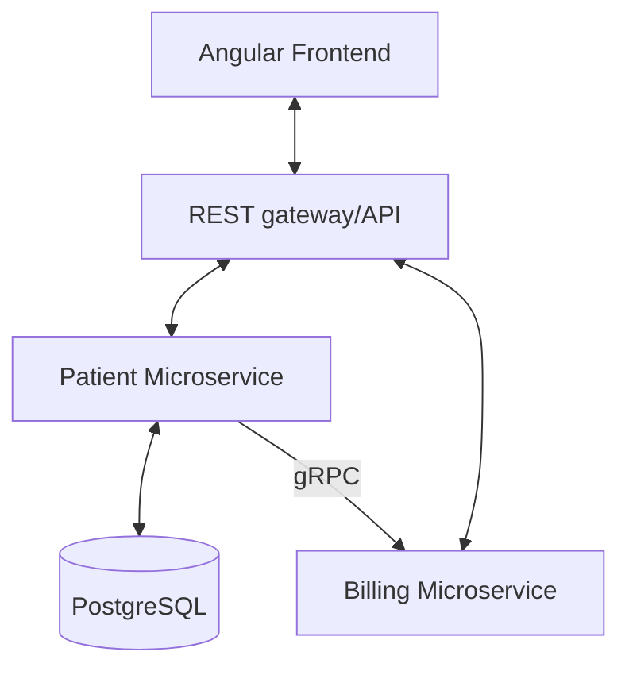

# OPD Management System

A robust, full-stack Outpatient Department (OPD) management system designed to streamline clinical workflows. The project consists of a modern **Angular 17** frontend and a **Spring Boot** microservices architecture.

## 🏛️ System Architecture

The system is built using a microservices pattern, where the frontend communicates with various backend services via REST and gRPC.



---

## 🚀 Key Features

### 👤 Role-Based Clinical Workflows
- **Admin**: System configuration, user management, and analytics.
- **Receptionist**: Patient onboarding, appointment scheduling, and token generation.
- **Doctor**: Clinical consultation, history tracking, and digital prescriptions.
- **Patient**: Self-service portal for appointments and medical records.

### 📋 Core Functionalities
- **Comprehensive Patient Management**: Digital registration with QR code identification.
- **Smart Scheduling**: Interactive calendar for appointment and slot management.
- **Real-time OPD Queuing**: Token-based check-in system for optimized patient flow.
- **Microservices Orchestration**: Scalable services with inter-service gRPC communication.
- **Rich Reporting**: Exportable medical reports (PDF) and analytical data (Excel).

---

## 🛠️ Technology Stack

### Frontend (OPD-management)
- **Framework**: [Angular 17+](https://angular.io/)
- **UI Library**: [PrimeNG](https://primeng.org/) & [PrimeFlex](https://primeflex.org/)
- **Visuals**: [Chart.js](https://www.chartjs.org/) & [PrimeIcons](https://primeng.org/icons)
- **Utilities**: `jspdf`, `xlsx`, `qrcode-generator`

### Backend (Patient-management)
- **Core**: [Java 21](https://www.oracle.com/java/technologies/downloads/), [Spring Boot 3.4.x](https://spring.io/projects/spring-boot)
- **Communication**: [gRPC](https://grpc.io/) (Inter-service), REST (Frontend-to-Backend)
- **Persistence**: [PostgreSQL](https://www.postgresql.org/), Spring Data JPA
- **API Documentation**: [SpringDoc OpenAPI (Swagger)](https://springdoc.org/)
- **Utilities**: Project Lombok, Maven

---

## 📂 Project Structure

```text
.
├── OPD-management/            # Angular Frontend
│   ├── src/app/core/          # Services, Guards, Models
│   ├── src/app/features/      # Domain-specific modules (Admin, Doctor, etc.)
│   └── src/app/shared/        # Reusable UI components
│
└── Patient-management/        # Spring Boot Microservices
    ├── patient-service/       # Core patient & consultation management
    ├── billing-service/       # gRPC-based billing engine
    └── grpc-requests/         # Shared gRPC service definitions
```

---

## ⚙️ Getting Started

### Prerequisites
- **Node.js**: v18+
- **Java**: 21+
- **Maven**: 3.9+
- **PostgreSQL**: 15+ (Running on port 5432)

### Installation & Setup

#### 1. Database Configuration
Create a PostgreSQL database named `patientdb`:
```sql
CREATE DATABASE patientdb;
```
Ensure your database credentials match `Patient-management/patient-service/src/main/resources/application.properties`.

#### 2. Start Backend Services
Navigate to each service directory and run:
```bash
# In patient-service and billing-service directories
mvn clean install
mvn spring-boot:run
```
- **Patient Service**: Running on http://localhost:8080 (Swagger: `/swagger-ui/index.html`)
- **Billing Service**: Running on http://localhost:4001 (gRPC port: 9001)

#### 3. Start Frontend App
```bash
cd OPD-management
npm install
npm start
```
Navigate to `http://localhost:4200/`.

---

## 🧪 Development & Quality

- **Linting & Formatting**: `npm run lint` and `npm run format` for frontend.
- **Unit Testing**: `npm test` (Angular) and `mvn test` (Spring Boot).
- **API Specs**: Access Swagger UI on the Patient Service for interactive API documentation.

---

## 👨‍💻 Contributing
Please ensure all commits adhere to the project's Prettier and ESLint configurations. Run full verification before pushing to GitHub.
